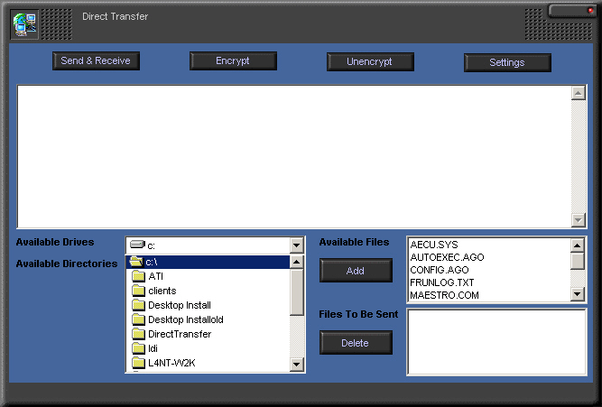



## TCP\\IP and Email Direct Transfer

### Description

File Transfer Program using Mapi and Winsock. Allows multiple connections, works from behind a proxy server, zips and encrypts files. Server and client programs
 
### More Info
 
Your IP addresses, ports, and email addresses

Read the readme.txt

Read the readme.txt

             |
---                |---
**Submitted On**   |2000-06-29 14:14:46
**By**             |[Peter Barth](https://github.com/Planet-Source-Code/PSCIndex/blob/master/ByAuthor/peter-barth.md)
**Level**          |Intermediate
**User Rating**    |4.8 (19 globes from 4 users)
**Compatibility**  |VB 3\.0, VB 4\.0 \(16\-bit\), VB 4\.0 \(32\-bit\), VB 5\.0, VB 6\.0, VB Script, ASP \(Active Server Pages\) 
**Category**       |[Complete Applications](https://github.com/Planet-Source-Code/PSCIndex/blob/master/ByCategory/complete-applications__1-27.md)
**World**          |[Visual Basic](https://github.com/Planet-Source-Code/PSCIndex/blob/master/ByWorld/visual-basic.md)
**Archive File**   |[CODE\_UPLOAD72886292000\.zip](https://github.com/Planet-Source-Code/peter-barth-tcp-ip-and-email-direct-transfer__1-9385/archive/master.zip)

